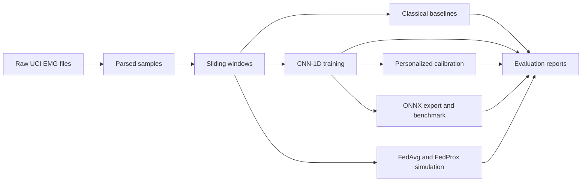

# neurogesture-edge-fl

`neurogesture-edge-fl` is a local-first Python project for EMG gesture recognition in wearable-control scenarios. It provides a reproducible pipeline for parsing the UCI EMG Data for Gestures dataset, building fixed-length EMG windows, evaluating centralized and subject-aware models, testing personalization, exporting edge-ready ONNX models, and simulating subject-level federated learning.

## What It Does

- Parses raw UCI EMG text files into validated sample tables.
- Converts continuous EMG streams into fixed-length sliding windows.
- Trains classical baselines and a compact CNN-1D model.
- Evaluates random splits, held-out subject splits, and limited calibration experiments.
- Exports CNN checkpoints to ONNX, applies INT8 quantization, and benchmarks CPU latency.
- Simulates FedAvg and FedProx with one subject per client and sample-weighted parameter aggregation.

## Pipeline

Raw EMG files -> parsed samples -> sliding windows -> baselines -> CNN -> personalization -> ONNX/edge -> federated simulation.



## Key Capabilities

- UCI EMG parser for subject folders and raw text recordings.
- Sliding-window generation with subject, recording, and gesture metadata.
- Classical baseline evaluation with logistic regression and random forest.
- CNN-1D training with `global_channel_zscore` normalization.
- Personalized calibration for held-out subjects.
- ONNX FP32 export, ONNX Runtime INT8 quantization, and latency benchmarking.
- FedAvg and FedProx simulations with subject-local clients.

## Current Results

| Item | Metric | Value |
|---|---|---:|
| Random Forest, random split | Macro F1 | 0.6960 |
| CNN-1D, random split | Macro F1 | 0.8724 |
| CNN-1D, subject split | Macro F1 | 0.7377 |
| Personalized calibration, full model | Mean delta macro F1 | +0.0430 |
| ONNX FP32 | Mean latency | 0.149 ms |
| FedAvg, 50-round seed benchmark | Mean best macro F1 | 0.7357 |
| FedProx, 50-round seed benchmark | Mean best macro F1 | 0.7355 |

Detailed results and experiment notes are in [docs/results.md](docs/results.md).
The federated values are 50-round seed-stability benchmark means across seeds 42, 123, and 2025.

## Dataset

The project uses the UCI EMG Data for Gestures dataset:

Krilova, N., Kastalskiy, I., Kazantsev, V., Makarov, V., & Lobov, S. (2018). EMG Data for Gestures. UCI Machine Learning Repository. https://doi.org/10.24432/C5ZP5C

Place the raw dataset under:

```text
data/raw/EMG_data_for_gestures-master/
```

Each raw text file is expected to contain 10 columns: time, 8 EMG sensor channels, and class label.

## Quickstart

Create and activate a Python 3.12 environment:

```powershell
python -m venv .venv
.\.venv\Scripts\Activate.ps1
python -m pip install --upgrade pip
pip install -r requirements.txt
```

Run tests:

```powershell
pytest
```

Build the processed dataset and windows:

```powershell
python src/data/make_dataset.py `
  --raw-dir data/raw/EMG_data_for_gestures-master `
  --output data/processed/emg_samples.parquet `
  --summary reports/metrics/dataset_summary.json

python src/data/make_windows.py `
  --input data/processed/emg_samples.parquet `
  --output data/processed/emg_windows.npz `
  --summary reports/metrics/window_summary.json `
  --window-size 200 `
  --stride 100
```

Train and evaluate models:

```powershell
python src/training/train_baseline.py `
  --windows data/processed/emg_windows.npz `
  --results reports/metrics/baseline_results.json `
  --figures-dir reports/figures `
  --models-dir models

python src/training/train_deep.py `
  --windows data/processed/emg_windows.npz `
  --results reports/metrics/deep_results.json `
  --models-dir models `
  --model cnn1d `
  --epochs 10 `
  --batch-size 128 `
  --normalization global_channel_zscore

python src/personalization/evaluate_calibration.py `
  --windows data/processed/emg_windows.npz `
  --base-model models/cnn1d_subject_split_best.pt `
  --results reports/metrics/personalization_results.json `
  --mode last_layer `
  --calibration-per-class 10 `
  --epochs 5 `
  --batch-size 64
```

Export and benchmark ONNX:

```powershell
python src/edge/export_onnx.py `
  --checkpoint models/cnn1d_subject_split_best.pt `
  --output models/onnx/cnn1d_fp32.onnx `
  --windows data/processed/emg_windows.npz

python src/edge/quantize_onnx.py `
  --input models/onnx/cnn1d_fp32.onnx `
  --output models/onnx/cnn1d_int8.onnx

python src/edge/benchmark_latency.py `
  --fp32-model models/onnx/cnn1d_fp32.onnx `
  --int8-model models/onnx/cnn1d_int8.onnx `
  --output reports/metrics/edge_benchmark.json `
  --warmup 20 `
  --runs 200
```

Run federated simulations:

```powershell
python src/federated/simulate_fedavg.py `
  --windows data/processed/emg_windows.npz `
  --results reports/metrics/federated_results.json `
  --rounds 50 `
  --clients-per-round 8 `
  --local-epochs 2 `
  --batch-size 64

python src/federated/simulate_fedprox.py `
  --windows data/processed/emg_windows.npz `
  --results reports/metrics/fedprox_results.json `
  --rounds 50 `
  --clients-per-round 8 `
  --local-epochs 2 `
  --batch-size 64 `
  --mu 0.001
```

More detailed reproduction steps are in [docs/reproducibility.md](docs/reproducibility.md). The module layout is summarized in [docs/architecture.md](docs/architecture.md).

## Data and Artifact Policy

Raw data, processed data, generated reports, figures, model checkpoints, ONNX files, and benchmark JSON files are intentionally ignored by Git. They can be reproduced locally from the commands above.

## Current Limitations

- `extended_palm` is underrepresented.
- Federated results are baseline experiments, not optimized federated learning methods.
- ONNX INT8 reduces model size but is slower than FP32 in the local CPU benchmark.
- Real-device integration is future work.

## Citation

If you use the dataset through this project, cite:

Krilova, N., Kastalskiy, I., Kazantsev, V., Makarov, V., & Lobov, S. (2018). EMG Data for Gestures. UCI Machine Learning Repository. https://doi.org/10.24432/C5ZP5C
