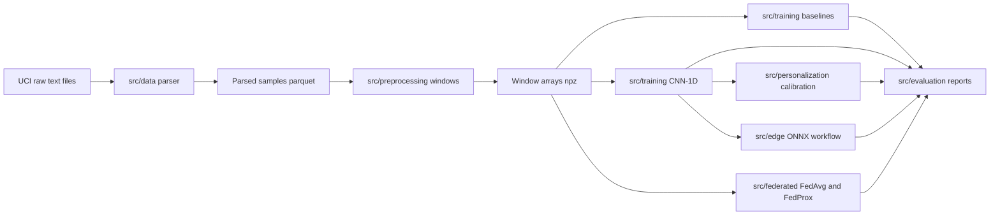

# Architecture

This project is organized as a reproducible local pipeline for EMG gesture recognition, subject-aware evaluation, personalization, edge export, and federated simulation.

## Pipeline Diagram

## Module Overview

| Module | Role |
|---|---|
| `src/data` | Parses raw UCI EMG text files, builds processed sample tables, and creates window datasets. |
| `src/preprocessing` | Provides windowing, normalization, and feature utilities. |
| `src/models` | Defines classical model helpers, CNN-1D, and TCN model components. |
| `src/training` | Runs classical baseline and deep learning training workflows. |
| `src/personalization` | Simulates limited calibration for held-out subjects. |
| `src/edge` | Exports CNN checkpoints to ONNX, applies INT8 quantization, and benchmarks inference latency. |
| `src/federated` | Runs subject-level FedAvg and FedProx simulations with sample-weighted aggregation. |
| `src/evaluation` | Provides split logic, fixed-label metrics, JSON reports, and confusion matrix plotting. |

## Generated Artifacts

Generated artifacts are intentionally kept out of Git because they depend on local raw data, training runs, hardware, or runtime environment.

| Location | Contents |
|---|---|
| `data/raw/` | Local copy of the raw UCI dataset. |
| `data/processed/` | Parsed sample parquet files and compressed window arrays. |
| `reports/metrics/` | JSON summaries, model metrics, personalization metrics, edge benchmarks, and federated reports. |
| `reports/figures/` | Generated confusion matrix figures and other plots. |
| `models/` | Joblib models, PyTorch checkpoints, ONNX exports, and quantized ONNX models. |

These files can be regenerated locally with the commands in [reproducibility.md](reproducibility.md).
